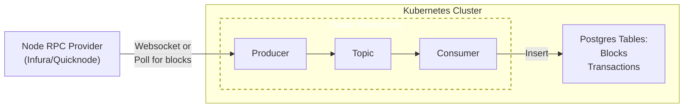

# Blockchain Data Ingestion (WIP)

***Project Progress***:  `[##--------]` 15%

A **Rust-based** solution for ingesting, transforming, and storing blockchain data from various networks. The project aims to make it straightforward to collect meaningful on-chain data—like blocks, transactions, logs, or custom events—and load it into a **Postgres** or **DuckDB** database for further analysis. The codebase can be run locally on your machine or deployed to a server environment.

---

## Table of Contents
1. [Overview](#overview)  
2. [Features](#features)  
3. [Architecture](#architecture)  
4. [Getting Started](#getting-started)  
5. [Usage](#usage)  
6. [Configuration](#configuration)  
7. [Data Models](#data-models)  
8. [Roadmap](#roadmap)  
9. [Contributing](#contributing)  
10. [License](#license)  

---

## Overview
Blockchain Data Ingestion is designed to:
- Connect to various blockchain networks (e.g., Ethereum, Arbitrum, Polygon).
- Collect and parse data related to blocks, transactions, logs, and more.
- Transform raw data into organized structures for use in **Postgres** or **DuckDB**.
- Scale horizontally to handle large volumes of on-chain events.

This repository centralizes the ingestion logic, schemas, transformations, and connectors used to feed downstream analytics, machine learning pipelines, or any services building APIs/endpoints on top of your ingested data.

---

## Features
- **Multi-Chain Support:** Ingest data from various blockchain networks by simply updating configuration files or toggling relevant connectors.
- **EVM Adapter (WIP):** Includes an EVM-based adapter (`EVMAdapter`) that lets you:
  - Fetch historical blocks over a specified range.
  - Subscribe to new blocks for real-time ingestion.
  - Retrieve the latest block and its transactions.
- **Scalable Architecture:** Support both batch (historical) and streaming ingestion modes for small or large data loads.
- **Multiple Storage Backends:** Choose between **Postgres** or **DuckDB** to persist your blockchain data.
- **Data Validation:** Basic schema validation to ensure that ingested data is consistent and accurate.

---

## Architecture



1. Data is retrieved from a node RPC provider (Infura or QuickNode).
2. A Pulsar producer ingests that data into a Pulsar topic.
3. A Pulsar consumer reads messages from that topic and writes them to postgres
4. In Postgres two tables are created (blocks & transactions tables).

---

## Getting Started

### Prerequisites
- **Rust** (version 1.60+ recommended). Install using [rustup](https://rustup.rs/).  
- **cargo** (comes with Rust, used to build and run the project).  
- **A blockchain node or provider** (Infura, Alchemy, or a self-hosted node for the chain(s) of your choice).  


### Installation

1. **Clone the repository**:
   ```bash
   git clone https://github.com/bluecagz/blockchain-data-ingestion.git
   cd blockchain-data-ingestion
   ```

2. **Build the Project**  
   ```bash
   cargo build --release
   ```
   This will compile the code in **release** mode, optimizing for performance.  
   *For quicker dev cycles, you can use:*  
   ```bash
   cargo build
   ```

3. **Set Up Environment Variables**  
   - Copy or rename `.env.example` to `.env`.  
   - Update values (e.g., provider endpoints, Postgres/DuckDB credentials or file paths).

---

## Usage

Once you’ve built the project, you can run the data ingestion either locally or on a server.

### Local Run

```bash
cargo run --release
```

_(for debug mode):_
```bash
cargo run
```

Depending on your configuration, this might:
- Connect to a specified blockchain provider (Infura, Alchemy, etc.).
- Start fetching blocks/transactions from a given start block.
- Process data and store it in Postgres or DuckDB, as configured.
- Subscribe to real-time blocks for ongoing ingestion.

### Historical, Real-Time, and Latest-Block Ingestion

This project supports multiple ingestion strategies:

1. **Historical Ingestion**  
   - Fetch blocks within a range (`start_block..end_block`).  
   - Retries or backoff are implemented for rate-limit errors (HTTP 429).

2. **Real-Time Subscription**  
   - Connect via WebSocket to watch new blocks and ingest them as they appear.

3. **Latest Block Retrieval**  
   - Fetch the most recent block number, retrieve its transactions, and log them (or store them).  
   - Useful as a quick check that the pipeline is working.

---

## Configuration

**`blockchains.toml`**  
Defines each chain, its adapter type (e.g., `"EVM"`), and the RPC endpoints to use. Example:

```toml
[blockchains.ARB]
adapter_type = "EVM"
schemas = ["transactions"]
start_block = 293035442 # adding start block will turn on the historical stream
http_url = "ARBITRUM_URL"
ws_url = "ARBITRUM_URL_WS"
```

Values like `http_url` or `ws_url` refer to environment variables in your `.env` (e.g., `HTTP_URL_ARBITRUM`).

**`.env` File**  
Holds environment variables such as:  
```
ARBITRUM_URL="https://arb-mainnet.g.alchemy.com/v2/YOUR_API_KEY"
ARBITRUM_URL_WS="wss://arb-mainnet.g.alchemy.com/v2/YOUR_API_KEY"

```

---

## Data Models

- **Blocks**  
  - `block_number`  
  - `timestamp`  
  - `transactions_root`  
  - `miner`  
  - …  

- **Transactions**  
  - `hash`  
  - `from_address`  
  - `to_address`  
  - `value`  
  - `gas_used`  
  - `block_number`  
  - …  

- **Logs/Events**  
  - `log_index`  
  - `address`  
  - `topics`  
  - `data`  
  - `decoded_event`  
  - `transaction_hash`  
  - `block_number`  
  - …  

You can adapt these models to reflect more specialized data points (e.g., token transfers, NFT mint events, protocol-specific actions).

---

## Roadmap
- **Additional Chains**: Expand beyond Ethereum, Arbitrum, and Polygon, e.g., Avalanche, Optimism, BSC, etc.
- **MQ Integration**: Integrate Pulsar or Kafka for publishing block/transaction messages to downstream consumers.
- **Advanced Querying**: Explore custom SQL queries or engine optimizations for Postgres and DuckDB.
- **Monitoring & Alerting**: Add metrics support (e.g., Prometheus) and real-time alerts.


---

## Contributing
We welcome contributions of all kinds:
1. Fork the repository  
2. Create a new feature branch (`git checkout -b feature/amazing-feature`)  
3. Commit your changes (`git commit -am 'Add amazing feature'`)  
4. Push the branch (`git push origin feature/amazing-feature`)  
5. Create a Pull Request  

Make sure to follow any coding conventions or style guidelines specified in this repo.

---

## License
This project is licensed under the [MIT License](LICENSE). Feel free to modify and distribute as per the license terms.

---

**Questions or Issues?**  
Feel free to open an issue on GitHub or reach out via email. Thank you for using and contributing to the Blockchain Data Ingestion project!
